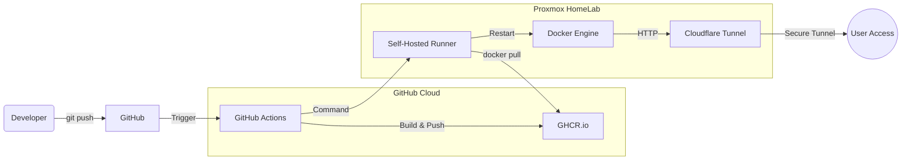

# Manucrew.pl - Hybrid Cloud DevOps Deployment

This repository hosts the source code and Infrastructure-as-Code (IaC) configuration for **manucrew.pl**. The project demonstrates a **DevOps-first approach** to hosting a web application on a private HomeLab infrastructure (Proxmox/LXC) with enterprise-grade security and full automation.

## 🏗 Architecture

The project utilizes a **Hybrid Cloud** model. Source code and build processes are managed in the cloud (GitHub), while the application runs on-premise, secured by a Zero Trust tunnel.

## 🚀 Key Features

* **Hybrid CI/CD Pipeline:** A fully automated workflow that builds Docker images in the cloud and deploys them to a local server using a **Self-Hosted Runner**.
* **Zero Trust Security:** The application is exposed via **Cloudflare Tunnel**, eliminating the need for open inbound ports or public IP addresses (CGNAT traversal).
* **Infrastructure as Code (IaC):** Deployment logic is defined in `docker-compose.yml` and versioned alongside the application code.
* **Containerization:** Fully containerized environment using **Docker** ensuring consistency between development and production.
* **Automatic Maintenance:** The pipeline includes steps to prune old Docker images (`docker image prune`), preventing disk space exhaustion on the LXC container.
* **Secret Management:** Sensitive data (Cloudflare Tokens) are injected at runtime via GitHub Secrets.

## 🛠 Tech Stack

* **Platform:** Proxmox VE (LXC Container / Debian)
* **Containerization:** Docker & Docker Compose
* **CI/CD:** GitHub Actions (Self-Hosted Runner)
* **Artifacts:** GitHub Container Registry (GHCR)
* **Networking:** Cloudflare Zero Trust (Tunnels)
* **Web Server:** Apache httpd

## ⚙️ Deployment Workflow

1. **Build:** GitHub Actions builds the Docker image from the `src/` directory upon every push to `main`.
2. **Push:** The image is tagged and pushed to the private GitHub Container Registry.
3. **Deploy:** The Self-Hosted Runner on the Proxmox server receives the trigger:
    * Authenticates with the registry.
    * Pulls the latest image artifact.
    * Recreates the containers using `docker compose up -d`.
    * Performs system cleanup.

## 🔒 Security Measures

* **No Open Ports:** The server operates behind a strict firewall with NO inbound ports open (80/443 blocked).
* **Isolation:** The CI/CD process runs on a restricted runner within the internal network.
* **HTTPS:** SSL/TLS is handled automatically by Cloudflare Edge.
* **Secrets:** No credentials are stored in the repository files.

---
*Created by [Adrjnk](https://github.com/Adrjnk)*